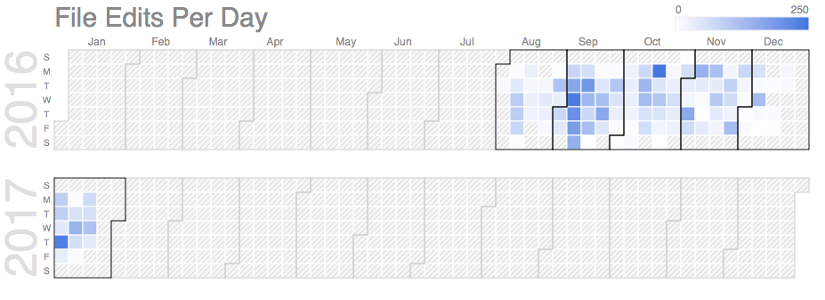

# Dropbox Activity Reports
Analyze Dropbox activity reports (F#).

This demonstrates how to use the CSV Type Provider and the JSON Type
Provider in FSharp.Data.

# Installing on Mac with the Mono .NET Toolchain

First, install Paket and download the Nuget dependencies

    mono .paket/paket.bootstrapper.exe
    mono .paket/paket.exe install

# Run the Script

## List Popular Files by Month
The script has a `DEFAULT_FILENAME` that should point to your 
Activity Log output file (it would be in your Dropbox folder with a path like e.g.
`Dropbox Business reports/2016-12-13 full log.csv`.
You can also specify the path on the command line.

To run the script

    fsharpi analyze.fsx
	
Or, with an explicit path to the Activity Log:

    fsharpi analyze.fsx "path-to-Dropbox/Dropbox Business reports/2016-12-13 full log.csv"

## Show a Calendar of Edit Activity
You can also show a calendar of the edit activity. Just invoke
`editsbyday.fsx` with a path to the Activity Log file.

    fsharpi editsbyday.fsx  "path-to-Dropbox/Dropbox Business reports/2016-12-13 full log.csv"

This uses the great FS Lab charting features. 
The calendar will open in the default browser.

